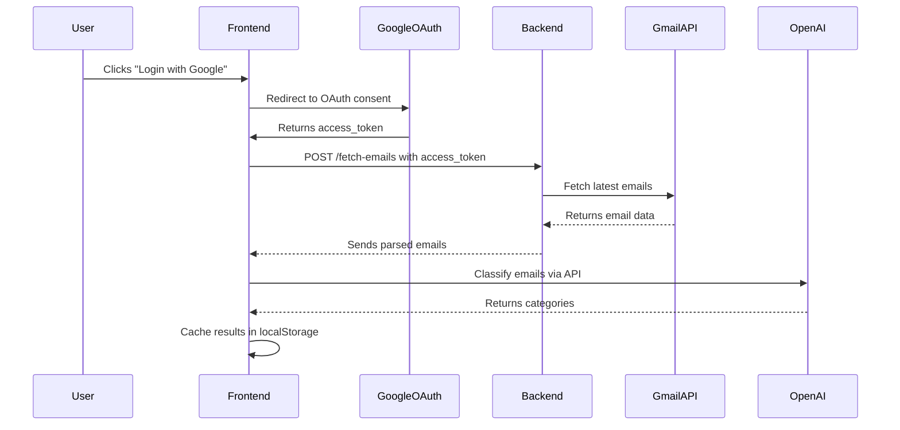

## Check the ScreenShots Folder for ScreenShots of Application

## 🚀 Features

- **Google OAuth Integration** – Securely authenticate users using their Google accounts.
- **Gmail API Integration** – Fetch recent emails directly from the user’s Gmail inbox.
- **Email Classification (AI-powered)** – Classifies emails into predefined categories using OpenAI's model.
- **Caching & Persistence** – Prevents redundant API calls by storing classification results locally.
- **Dynamic Filtering** – View emails based on selected classification categories from a dropdown menu.
- **Interactive Dashboard** – Displays all classified emails grouped neatly by category for quick insights.
- **Email Detail View** – Clicking an email opens a right-hand sidebar overlay showing the full email details (subject, sender, snippet, and body).
- **Automatic Refresh** – Fetches new emails only when the user explicitly requests via the “Fetch My Emails” button.
- **Clean Navigation** – Smooth transitions between Emails Page and Dashboard without data loss.
- **Error Handling & Fallbacks** – Gracefully handles missing access tokens, Gmail API errors, or empty email results.

> This project showcases seamless integration of Gmail API, OpenAI API, and modern React-based frontend design for an intelligent email organization system.


## 🧠 Tech Stack

### **Frontend**
- **React.js (Vite)** – Fast, modern frontend framework for building dynamic UIs.
- **React Router** – Enables smooth navigation between app routes (Emails, Dashboard, etc.).
- **Tailwind CSS / Inline Styling** – For responsive and clean design components.
- **LocalStorage API** – Used for caching classification results and persisting email data between routes.

### **Backend**
- **Node.js + Express.js** – Lightweight server for handling Gmail API and OpenAI API requests.
- **Google APIs (Gmail)** – Fetches email metadata and body content securely using OAuth2.
- **OpenAI API** – Classifies emails into categories (Important, Promotions, Social, Marketing, Spam, General).

### **AI Integration**
- **OpenAI GPT Model** – Used for intelligent text classification of email content.
- **Prompt Engineering** – Carefully designed prompts ensure accurate and context-aware categorization.

### **Authentication**
- **Google OAuth 2.0** – Handles secure user authentication and authorization for accessing Gmail data.

### **Storage & Caching**
- **Browser LocalStorage** – Maintains cached email and classification data to minimize API calls.

### **Development Tools**
- **Vite** – Superfast build tool and dev server for React.
- **Axios / Fetch API** – Handles HTTP requests to backend endpoints.
- **Nodemon** – Auto-restarts the Node.js server during development.
- **ESLint + Prettier** – For consistent and clean code formatting.

# ⚙️ Setup Instructions

Follow these steps to set up and run the project locally.

## 1. Clone the repository
```bash
git clone https://github.com/<your-username>/<your-repo-name>.git
cd <your-repo-name>
```

## 2. Install dependencies

**Backend (server):**
```bash
cd server
npm install
```

**Frontend (client):**
```bash
cd client
npm install
```

## 3. Create a Google Cloud Project & OAuth credentials

1. Go to the [Google Cloud Console](https://console.cloud.google.com/).
2. Create a new project (e.g., `GmailClassifier`).
3. In **APIs & Services → Library**, enable **Gmail API** for your project.
4. In **APIs & Services → OAuth consent screen**:
   - Configure the app (External or Internal depending on your use).
   - Add your Google account as a **Test user** (while developing).
5. In **APIs & Services → Credentials**, create **OAuth 2.0 Client ID**:
   - **Application type:** Web application
   - **Authorized JavaScript origins:** `http://localhost:5173`
   - **Authorized redirect URIs:** `http://localhost:5173`
6. Copy the **Client ID** (you will use it in the frontend). You can also copy the **Client Secret** if you plan to use a server-side code flow.

## 4. Create environment files

Create `.env` files in both `server` and `client` directories.

**Server (`server/.env`):**
```ini
PORT=5000
GOOGLE_CLIENT_ID=<your-google-client-id>
GOOGLE_CLIENT_SECRET=<your-google-client-secret>   # only if you use server-side flows
GOOGLE_REDIRECT_URI=http://localhost:5173           # optional for some flows
```

**Client (Vite) (`client/.env`):**
```ini
VITE_GOOGLE_CLIENT_ID=<your-google-client-id>
VITE_REDIRECT_URI=http://localhost:5173
```

**Important:** With Vite, only variables prefixed with `VITE_` are exposed to the frontend. Do not commit `.env` files to source control — add them to `.gitignore`.

## 5. Start the backend server

Open a terminal:
```bash
cd server
npm run dev
```

The backend default URL: `http://localhost:5000`

## 6. Start the frontend app

Open another terminal:
```bash
cd client
npm run dev
```

The frontend default URL: `http://localhost:5173`

## 7. First-time Google OAuth / Test Users

If your app is in **Testing** mode in Google Cloud:

- Make sure the account you use to log in is added under **OAuth consent screen → Test users**.
- During OAuth you may see an "unverified app" warning — click **Advanced → Go to \<app\> (unsafe)** for local development.

## 8. Run the app (basic flow)

1. Visit `http://localhost:5173`.
2. Click **Login with Google** and sign in with a test user account.
3. Save your **OpenAI API key** in the UI (stored locally in `localStorage`).
4. Click **Fetch My Emails** to fetch emails from Gmail (the server calls Gmail API using your Google access token).
5. On the **Emails** page, choose how many emails to show, pick K and click **Classify** to classify them via OpenAI.
6. Use **Dashboard** to view emails grouped by category. Click an email to open the right-hand sidebar with the full body.

## 9. Troubleshooting & tips

**If Gmail fetching fails with permission errors, verify:**

- The **Gmail API** is enabled in the same Google Cloud project as your OAuth credentials.
- The account you're signing in with is added as a **Test user** (if app is unverified/testing).
- The `VITE_GOOGLE_CLIENT_ID` value in `client/.env` matches the client ID in Google Console.

**If you see `redirect_uri_mismatch`:**

- Ensure the redirect URI in Google Console exactly matches `VITE_REDIRECT_URI`.

**If classification fails:**

- Verify your OpenAI key is valid and has quota.

**If you change `.env` values:**

- Restart the dev servers.


## 🔐 Authentication & API Integration

This project integrates **Google OAuth2** for user authentication and the **Gmail API** for fetching emails, along with the **OpenAI API** for email classification.

---

### 🧭 1. Google OAuth2 Authentication

The app uses Google's **OAuth 2.0** flow to allow users to log in securely and grant read access to their Gmail inbox.

#### **Frontend flow**

1. When the user clicks **Login with Google**, the app redirects them to Google's consent screen.
2. After the user authorizes the app, Google redirects back to:
```
   http://localhost:5173
```
3. The frontend extracts the **access token** from the redirect response and stores it temporarily in `localStorage`.

#### **Backend flow**

- The access token is sent to the backend when fetching emails.
- The backend uses this token to authenticate Gmail API calls on behalf of the user.
- The app **does not store or reuse** tokens — they remain only in the active browser session.

#### **Gmail API Scopes Used**
```text
https://www.googleapis.com/auth/gmail.readonly
```

This allows read-only access to the user's Gmail messages — no send, modify, or delete permissions are requested.

---

### ✉️ 2. Gmail API Integration

Once authenticated, the app calls:
```bash
POST /fetch-emails
```

with the user's access token.

**Backend process:**

1. The Express backend initializes a `google.auth.OAuth2()` client.
2. Sets credentials using the access token from the frontend.
3. Fetches the latest N messages using:
```js
   gmail.users.messages.list({ userId: "me", maxResults: numEmails })
```
4. For each message ID, fetches full details using:
```js
   gmail.users.messages.get({ userId: "me", id: msg.id })
```
5. Extracts:
   - **Subject**
   - **From**
   - **Snippet** (preview)
   - **Body** (decoded & cleaned)
6. The backend then returns an array of structured email data to the frontend.

---

### 🧠 3. OpenAI API Integration

After fetching emails, the user can classify them by clicking the **Classify** button.

**How it works:**

1. The frontend reads the locally stored OpenAI API key (entered by the user).
2. Sends the top K selected emails to the OpenAI API for classification.
3. The classifier analyzes each email and assigns a category, such as:
   - **Important**
   - **Promotions**
   - **Social**
   - **Marketing**
   - **Spam**
   - **General**
4. The results are cached locally in `localStorage` to avoid re-evaluation unless explicitly requested again.

---

### 🔄 4. Data Flow Overview


## ⚙️ Environment Variables

This project uses a few key environment variables to manage authentication, API keys, and configuration.  
You'll need to create a `.env` file **both in the backend and frontend** to store these values securely.

---

### 🖥️ Frontend (`.env`)

Create a `.env` file in the root of your **frontend** directory (e.g., `client/.env`):
```bash
VITE_GOOGLE_CLIENT_ID=your_google_oauth_client_id
VITE_REDIRECT_URI=http://localhost:5173
VITE_API_BASE_URL=http://localhost:5000
```

**Explanation:**

| Variable | Description |
|----------|-------------|
| `VITE_GOOGLE_CLIENT_ID` | Google OAuth 2.0 Client ID for authenticating users |
| `VITE_REDIRECT_URI` | URI where Google redirects users after successful login |
| `VITE_API_BASE_URL` | Base URL of your backend server (Express API) |

⚠️ **In Vite-based React apps, all environment variables must start with `VITE_` to be accessible in the code.**

---

### 🧩 Backend (`.env`)

Create a `.env` file in the backend root directory:
```bash
PORT=5000
GOOGLE_CLIENT_ID=your_google_oauth_client_id
GOOGLE_CLIENT_SECRET=your_google_oauth_client_secret
OPENAI_API_KEY=your_openai_api_key   # Optional if classification handled server-side
```

**Explanation:**

| Variable | Description |
|----------|-------------|
| `PORT` | Port number for your Express server |
| `GOOGLE_CLIENT_ID` | Google OAuth 2.0 Client ID (same as frontend) |
| `GOOGLE_CLIENT_SECRET` | Client secret from your Google Cloud Console |
| `OPENAI_API_KEY` | OpenAI API key used if backend performs classification |

---

### 🔑 How to Get These Keys

#### 1. Google OAuth Client

1. Go to [Google Cloud Console](https://console.cloud.google.com/).
2. Create a new project or select an existing one.
3. Navigate to **APIs & Services → Credentials → Create Credentials → OAuth Client ID**.
4. Choose **Web Application** and add:
   - **Authorized JavaScript origins:** `http://localhost:5173`
   - **Authorized redirect URIs:** `http://localhost:5173`
5. Copy your **Client ID** and **Client Secret** into your `.env` files.

#### 2. OpenAI API Key

1. Go to [https://platform.openai.com/api-keys](https://platform.openai.com/api-keys)
2. Generate a new API key and save it securely.
3. You can choose to store it:
   - On the **frontend** (user enters it manually in UI), or
   - On the **backend** (for server-side classification).

## 🗂️ Folder Structure

Here's an overview of the project's structure, including both **frontend (React + Vite)** and **backend (Express + Node.js)** parts:
```
email-classifier-app/
│
├── backend/                        # Backend (Node.js + Express)
│   ├── server.js                   # Main Express server entry
│   ├── routes/
│   │   └── auth.js          # API routes for fetching and logic for Gmail API and email body 
│   │   
│   ├── package.json                # Backend dependencies and scripts
│   ├── .env                        # Backend environment variables
│
├── frontend/                       # Frontend (React + Vite)
│   ├── src/
│   │   ├── App.jsx                 # Main application and routes
│   │   ├── EmailsPage.jsx      # Displays emails and classification UI
│   │   ├── Dashboard.jsx       # Categorized dashboard of emails
│   │   ├── EmailSidebar.jsx    # Right-side overlay showing full email body
│   │   ├── helpers/
│   │   │   ├── classifyEmails.js   # Logic for OpenAI-based email categorization
│   │   │   ├── classifyEmails.js   # Logic for OpenAI-based email
│   │   │   └── fetchEmails.js    # API call to backend for Gmail data
│   │   ├── index.jsx               # React entry point
│   │   └── styles/                 # (Optional) global or component-specific styles
│   ├── vite.config.js              # Vite configuration
│   ├── package.json                # Frontend dependencies and scripts
│   ├── .env                        # Frontend environment variables
│   └── README.md                   # Optional frontend-specific documentation
│
├── .gitignore                      # Ignored files and folders
├── README.md                       # Main project documentation (this file)
└── LICENSE                         # License file (if applicable)
```

### 🔍 Highlights

- **`backend/`** — Handles Gmail API integration, routes, and OpenAI classification logic.
- **`frontend/`** — Implements user-facing features like authentication, email viewing, and dashboards.
- **`helpers/storageHelpers.js`** — Ensures caching and smooth transitions between routes.
- **`components/EmailSidebar.jsx`** — Displays a detailed email body in an interactive side panel.
- **`helpers/classifyEmails.js`** — Uses OpenAI API to automatically categorize fetched emails.

---

## 💾 Local Storage Data Reference

The app uses **browser localStorage** to persist session and classification data across routes and reloads.  
Here’s a breakdown of each key stored locally and its purpose:

| Key | Description | Stored By | Used In |
|-----|--------------|-----------|---------|
| **`access_token`** | The OAuth2 access token returned by Google during authentication. Used for authorized Gmail API requests. | Login flow (`App.jsx`) | Backend API calls (`/fetch-emails`) |
| **`user`** | Basic user profile information (name, email) returned from Google OAuth. | Login flow (`App.jsx`) | UI display and personalization |
| **`emails`** | Array of the latest fetched emails (subject, sender, snippet, and body). | Backend (`fetch-emails` API) | Displayed on **EmailsPage.jsx** |
| **`classifiedEmails`** | Cached categorized emails after OpenAI classification. Prevents redundant reclassification unless user refetches emails. | `classifyEmails.js` | Both **EmailsPage.jsx** and **Dashboard.jsx** |
| **`emailsMeta`** | Metadata about email fetches, like timestamp, total emails, and Gmail query info (if implemented). Helps detect stale cache. | Backend (`fetch-emails` API) | Used for validating cache freshness |
| **`openai_api_key`** | The user’s OpenAI API key for email classification. Stored locally for privacy; never sent to backend. | Frontend settings / user input | `classifyEmails.js` |

---

### ⚙️ Notes
- All localStorage entries are **cleared automatically** when the user clicks **“Fetch My Emails”**, to remove stale data before a new fetch.  
- Cached `classifiedEmails` are **reused** when navigating between `/emails` and `/dashboard`, avoiding unnecessary OpenAI API calls.  
- Sensitive data (like API keys and tokens) are **never hardcoded** or shared; they remain private in the user’s browser.

---

📦 *Tip:* If you ever face stale or incorrect data, open the browser console and run:
```js
localStorage.clear();
